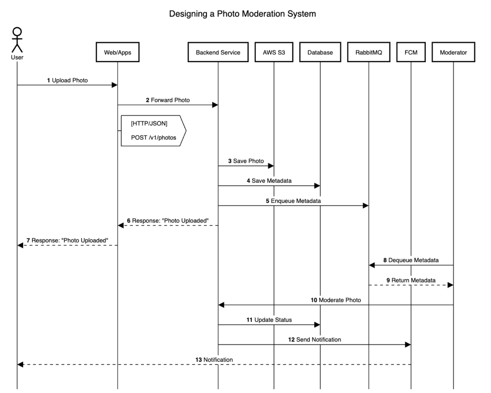
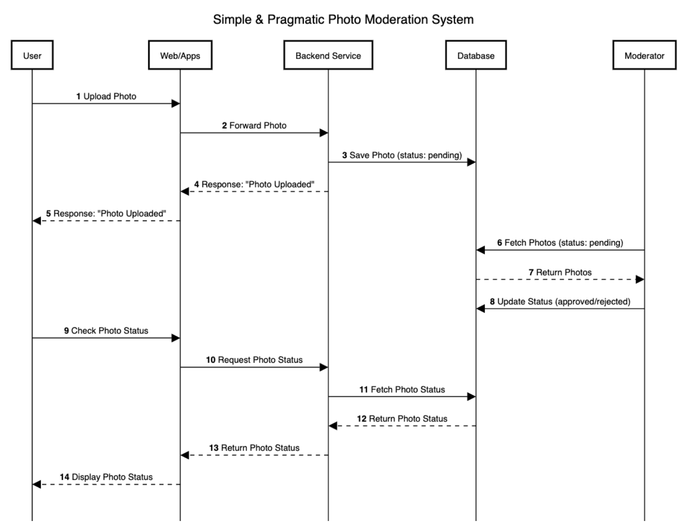

# Basic Questions & Answers

## Question:
Imagine you're building a website that allows users to submit photos. One of the requirements is that each photo must be reviewed by a moderator before it can be published. How would you design the logic for this process? What technologies would you use? Do you have any data structure in mind to support this based on your technology of choice to handle those data? 

## Answer:

## Designing a Photo Moderation System for a Website

## Option 1 : Event-Driven
### Sequence Diagram


```plaintext
title Designing a Photo Moderation System

actor User
participant "Web/Apps" as WebApp
participant "Backend Service" as Backend
participant "AWS S3" as S3
participant Database
participant RabbitMQ
participant "FCM" as FCM
participant Moderator

autonumber
lifelinestyle :solid

User->WebApp: Upload Photo
WebApp->Backend: Forward Photo
aboxright right of WebApp: [HTTP/JSON] \n\nPOST /v1/photos

Backend->S3: Save Photo
Backend->Database: Save Metadata
Backend->RabbitMQ: Enqueue Metadata
Backend-->WebApp: Response: "Photo Uploaded"
WebApp-->User: Response: "Photo Uploaded"

Moderator->RabbitMQ: Dequeue Metadata
RabbitMQ-->Moderator: Return Metadata
Moderator->Backend: Moderate Photo
Backend->Database: Update Status
Backend->FCM: Send Notification
FCM-->User: Notification
```

#### How to Use
1. Go to https://sequencediagram.org/.
2. Paste the code above into the editor.
3. The diagram will be rendered automatically.


## Explanation of the Diagram

### **Participants**
1. **User**: The end-user uploading a photo.
2. **Web/Apps**: The frontend interface where the user interacts.
3. **Backend Service**: Handles business logic, such as saving photos, storing metadata, and sending notifications.
4. **Database**: Stores metadata about the photos (e.g., `user_id`, `file_path`, `status`).
5. **RabbitMQ**: A message broker used to queue photos for moderation.
6. **AWS S3**: Cloud storage for saving uploaded photos.
7. **FCM (Firebase Cloud Messaging)**: Sends notifications to the user.
8. **Moderator**: Reviews and approves/rejects photos.

### **Workflow**
1. **User** uploads a photo via **Web/Apps**.
2. **Web/Apps** forwards the photo to the **Backend Service**.
3. **Backend Service** saves the photo to **AWS S3** and metadata to the **Database**.
4. **Backend Service** sends metadata to **RabbitMQ** for moderation.
5. **Backend Service** responds to **Web/Apps** with "Photo Uploaded".
6. **Web/Apps** responds to **User** with "Photo Uploaded".
7. **Moderator** retrieves (**Dequeue**) metadata from **RabbitMQ**.
8. **RabbitMQ** returns the metadata to the **Moderator**.
9. **Moderator** moderates the photo and sends the result to the **Backend Service**.
10. **Backend Service** updates the photo status in the **Database**.
11. **Backend Service** sends a notification to **FCM**.
12. **FCM** sends a notification to the **User**.

### **Key Points**
- **Asynchronous Workflow**: The user does not wait for the moderation process to complete. The system uses a message broker (RabbitMQ) to decouple the upload and moderation processes.
- **Scalability**: The system can handle a large number of photo uploads and moderation tasks efficiently.
- **Reliability**: If the moderation service is temporarily unavailable, photos remain in the queue and can be processed later.

## Technologies Used

| **Component**         | **Technology**                                                                 |
|------------------------|--------------------------------------------------------------------------------|
| **Backend Service**    | Golang (Gin) / Node.js (Express.js) / Python (Flask/Django)                      |
| **Database**           | PostgreSQL / MySQL / Mongo DB                                                          |
| **Message Broker**     | RabbitMQ / Apache Kafka                                                         |
| **File Storage**       | AWS S3 / Google Cloud Storage                           |
| **Notification**       | Firebase Cloud Messaging (FCM)                                                |


## Database Schema

```sql
CREATE TABLE photos (
    id SERIAL PRIMARY KEY,
    user_id INT NOT NULL,
    file_path VARCHAR(255) NOT NULL,  -- Path to the file in storage
    status VARCHAR(20) DEFAULT 'pending',  -- Status: pending, approved, rejected
    created_at TIMESTAMP DEFAULT CURRENT_TIMESTAMP,
    updated_at TIMESTAMP DEFAULT CURRENT_TIMESTAMP ON UPDATE CURRENT_TIMESTAMP
);
```
---


## Option 2 : Simple & Pragmatic

### Sequence Diagram


```plaintext
title Simple & Pragmatic Photo Moderation System

participant User
participant "Web/Apps" as WebApp
participant "Backend Service" as Backend
participant Database
participant Moderator

autonumber
lifelinestyle :solid

User->WebApp: Upload Photo
WebApp->Backend: Forward Photo
Backend->Database: Save Photo (status: pending)
Backend-->WebApp: Response: "Photo Uploaded"
WebApp-->User: Response: "Photo Uploaded"

Moderator->Database: Fetch Photos (status: pending)
Database-->Moderator: Return Photos
Moderator->Database: Update Status (approved/rejected)

User->WebApp: Check Photo Status
WebApp->Backend: Request Photo Status
Backend->Database: Fetch Photo Status
Database-->Backend: Return Photo Status
Backend-->WebApp: Return Photo Status
WebApp-->User: Display Photo Status
```

#### How to Use
1. Go to https://sequencediagram.org/.
2. Paste the code above into the editor.
3. The diagram will be rendered automatically.

## Explanation of the Diagram

### **Participants**
1. **User**: The end-user uploading a photo.
2. **Web/Apps**: The frontend interface where the user interacts.
3. **Backend Service**: Handles business logic, such as saving photos, storing metadata, and sending notifications.
4. **Database**: Stores metadata about the photos (e.g., `user_id`, `file_path`, `status`).
5. **RabbitMQ**: A message broker used to queue photos for moderation.
6. **AWS S3**: Cloud storage for saving uploaded photos.
7. **FCM (Firebase Cloud Messaging)**: Sends notifications to the user.
8. **Moderator**: Reviews and approves/rejects photos.

### **Workflow**
1. **User Uploads Photo**:
   - The user uploads a photo via the **Web/Apps**.
   - The photo is saved directly to the **Database** with a status of `pending`.

2. **Moderator Reviews Photo**:
   - A moderator retrieves photos with the `pending` status from the **Database**.
   - The moderator reviews the photo and updates the status to either `approved` or `rejected`.

3. **User Checks Status**:
   - The user periodically polls the system to check the status of their uploaded photo.

### **Key Points**
- **Simple Implementation**: No need for a message broker or event-driven architecture.
- **Polling Mechanism**: Users periodically check the status of their photos.
- **Direct Database Interaction**: Photos are stored and updated directly in the database.

## Technologies Used

| **Component**         | **Technology**                                                                 |
|------------------------|--------------------------------------------------------------------------------|
| **Backend Service**    | Golang (Gin) / Node.js (Express.js) / Python (Flask/Django)                      |
| **Database**           | PostgreSQL / MySQL                                                              |
| **Message Broker**     | RabbitMQ / Apache Kafka                                                         |
| **File Storage**       | AWS S3 / Google Cloud Storage                             |
| **Notification**       | Firebase Cloud Messaging (FCM)                                                |


## Database Schema

```sql
CREATE TABLE photos (
    id SERIAL PRIMARY KEY,
    user_id INT NOT NULL,
    file_path VARCHAR(255) NOT NULL,  -- Path to the file in storage
    status VARCHAR(20) DEFAULT 'pending',  -- Status: pending, approved, rejected
    created_at TIMESTAMP DEFAULT CURRENT_TIMESTAMP,
    updated_at TIMESTAMP DEFAULT CURRENT_TIMESTAMP ON UPDATE CURRENT_TIMESTAMP
);
```