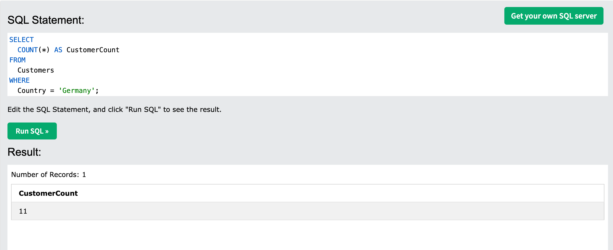
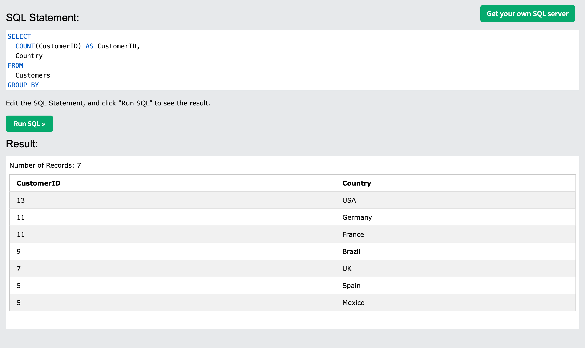
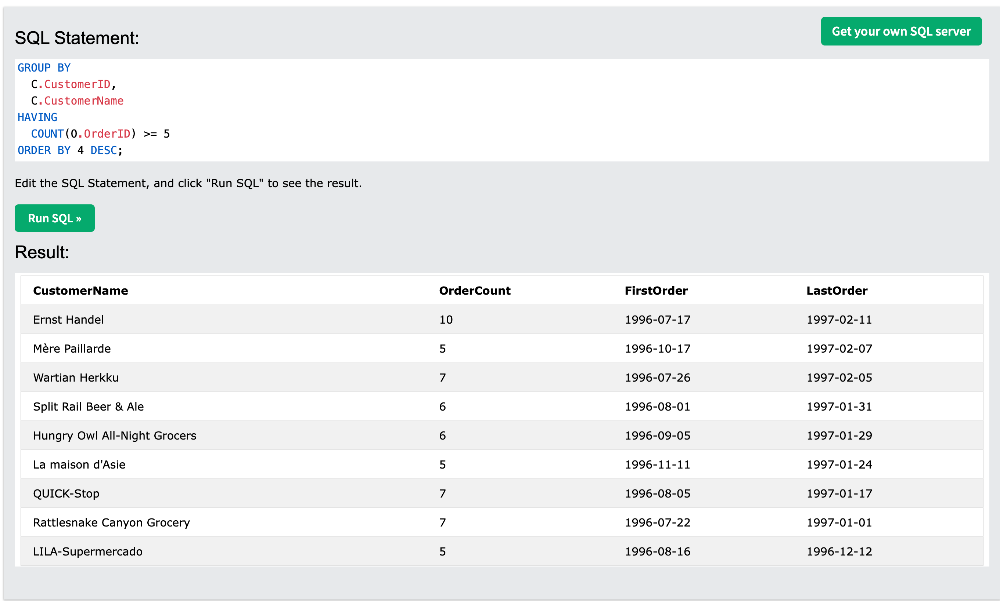

# Database Questions & Answers

## Level 1 (Novice - Expected Task Time: 1 minute):
## Question:
Write a SQL query that shows me how many customers there are from Germany.

## Answer:
```sql
SELECT
  COUNT(*) AS CustomerCount
FROM
  Customers
WHERE
  Country = 'Germany';
```


---

## Level 2 (Business Admin - Expected Task Time <4 minutes):
## Question:
Write a query that shows me a list of the countries that have the most customers; from most customers to least customers. Don’t show countries that have less than 5 customers.

## Answer:
```sql
SELECT 
  COUNT(CustomerID) AS CustomerID, 
  Country 
FROM 
  Customers 
GROUP BY 
  Country 
HAVING 
  COUNT(*) >= 5 
ORDER BY 1 DESC;
```


---

## Level 3 (Average Developer - Expected Task Time <8 minutes):
## Question:
Reverse Engineer These Results (tell me the query that we need to write to get these results):

| CustomerName                     | OrderCount | FirstOrder  | LastOrder   |
|-----------------------------------|------------|-------------|-------------|
| Ernst Handel                     | 10         | 1996-07-17  | 1997-02-11  |
| Wartian Herkku                   | 7          | 1996-07-26  | 1997-02-05  |
| QUICK-Stop                       | 7          | 1996-08-05  | 1997-01-17  |
| Rattlesnake Canyon Grocery       | 7          | 1996-07-22  | 1997-01-01  |
| Split Rail Beer & Ale            | 6          | 1996-08-01  | 1997-01-31  |
| Hungry Owl All-Night Grocers     | 6          | 1996-09-05  | 1997-01-29  |
| Mère Paillarde                  | 5          | 1996-10-17  | 1997-02-07  |
| La maison d'Asie                 | 5          | 1996-11-11  | 1997-01-24  |
| LILA-Supermercado                | 5          | 1996-08-16  | 1996-12-12  |

## Answer:
```sql
SELECT 
  C.CustomerName, 
  COUNT(O.OrderID) AS OrderCount, 
  FORMAT(
    MIN(O.OrderDate), 'YYYY-MM-DD'
  ) AS FirstOrder, 
  FORMAT(
    MAX(O.OrderDate), 'YYYY-MM-DD'
  ) AS LastOrder 
FROM 
  Customers C 
  INNER JOIN Orders O ON C.CustomerID = O.CustomerID 
GROUP BY 
  C.CustomerID, 
  C.CustomerName 
HAVING 
  COUNT(O.OrderID) >= 5 
ORDER BY 4 DESC;
```
